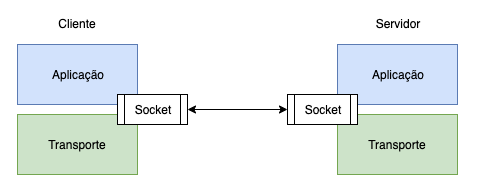
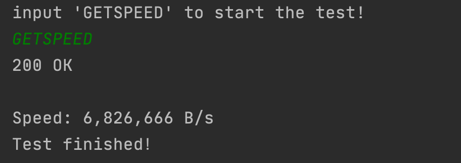

# CreateAndTestNics
### 场景描述
任务目的主要是想通过SDK的方式维护云服务器的网卡信息，主要是想通过SDK管理网卡信息。
### 前提条件
服务器环境：

1. 硬件规格： 
    通用计算增强型 | c6.large.2 | 2vCPUs | 4GB

2. 系统：
    CentOS 8.0 64bit

3. 网络环境：
    119.3.162.133 | 5 Mbit/s

本地开发环境：

1. JDK 环境 
    jdk1.8 | IDEA | Maven
   
2. SDK 安装
    导入开发相关的依赖信息
    
    1. 测试任务中给出的参考文档是旧版本的，不建议采用，请移步新版本：
    https://github.com/huaweicloud/huaweicloud-sdk-java-v3
    2. 关于Java SDK 开发工具包的详细使用说明，请查看：
    https://github.com/huaweicloud/huaweicloud-sdk-java-v3/blob/master/README_CN.md

### 示例代码及相关说明

一、 配置信息如下：
```java
    // 访问密钥
    private static String ak = "your ak";
    // 私有的访问密钥
    private static String sk = "your sk";
    // 云服务所在的项目id
    private static String projectId = "05999653698026a82fc1c013159ed5a8";
    // 华为云账号id
    private static String domainId = "0589a289f880250a0f89c0138b27c800";
    //endpoint Url
    private static String endpoint = "https://ecs.cn-north-4.myhuaweicloud.com";
    // 实例id
    private static String serId = "b13618a8-ee74-44ba-8620-dc41b032e631";
    private static String serId2 = "a1d6ccc8-4b9a-468d-b75f-467d62501e9d";
    // 子网id
    private static String subNetId = "6b6dbad3-3877-43ea-b443-5f1b421c054a";
    // 子网地址
    private static String newIpAddr = "192.168.0.244";
    // 网卡ID
    private static String nicId = "a9dbaf4a-cd52-4021-8cfc-7de8000d7a39";
```    
其中我把几个比较重要的，大家可能容易理解错误的地方指出，希望大家可以少走弯路：
    
   1.  关于密钥的信息：这个是在控制台左上角->用户->我的凭证->访问密钥 中，可以创建和删除密钥。下载的文件中包含ak和sk。
   2.  项目的id：在我的凭证->项目列表 中，这些项目ID要和自己的服务器所在的区域对应。
   3. 云账号id：同样在我的凭证->API凭证中，这里是账号ID
   4. 关于endpoint url，千万不能搞错，根据你的服务器的位置来确定，具体请移步：https://developer.huaweicloud.com/endpoint
    这里千万要注意，这里的url中的区域一定要与你的项目的区域对应上，不然旧后悔去吧，这个位置会更是个大坑。
   5. 实例id：就是你的服务器的id。
   6. 子网id：记住这个是网络id，并不是子网id，进入网络控制台的子网菜单中后，会有子网id和网络id，这里是网络ID；千万记住。
   7. 网卡id：指的是在删除网卡的时候会需要的id，这个在你添加网卡后，会有，在删除网卡是需要，方便测试，我也把这个写进来了。


二、 创建认证及ECS客户端如下
```java
    // 创建Region级服务
    private static BasicCredentials auth = new BasicCredentials()
            .withAk(ak)
            .withSk(sk)
            .withProjectId(projectId);

    // Global级服务，全局服务当前仅支持IAM, TMS, EPS。
    private static GlobalCredentials credentials = new GlobalCredentials()
            .withAk(ak)
            .withSk(sk)
            .withDomainId(domainId);

    // 创建 ECS 客户端
    private static EcsClient ecsClient = EcsClient.newBuilder()
            .withHttpConfig(config)
            // 使用Region级服务认证
            .withCredential(auth)
            .withEndpoint(endpoint)
            .build();
```
创建认证和ECS客户端的过程比较简单，主要注意的内容，我在上边已经说了，具体注意事项可以参考上边的。

比较重要的一定是，一定要去看看官方的新版本的文档，这里再次把地址列出来：https://github.com/huaweicloud/huaweicloud-sdk-java-v3/blob/master/README_CN.md 
很多需要注意的细节这里有说明，另外，如果你使用了Global级的服务，仅支持IAM, TMS, EPS，所以请注意这点。

三、 添加网卡
```java
public static void addInterface(EcsClient ecsClient, String serId, String subNet, String ipAddr) {
        try {
            // 指定子网以及你要配置的ip地址信息，这里可以添加多个ip及子网信息，是可以添加多个网卡的，
            // 但是由于这里只能添加一个所以，我没在写多个的代码，其实也很简单，就是把多个网卡的配置信息存在了一个list中即可。
            BatchAddServerNicOption option = new BatchAddServerNicOption()
                    .withSubnetId(subNet)
                    .withIpAddress(ipAddr);
            // 封装你的option到一个body中
            BatchAddServerNicsRequestBody body = new BatchAddServerNicsRequestBody()
                    .addNicsItem(option);
            // 将你封装的配置信息和你的服务器的id信息作为请求发送至服务器
            BatchAddServerNicsRequest request = new BatchAddServerNicsRequest()
                    .withServerId(serId)
                    .withBody(body);

            BatchAddServerNicsResponse batchAddServerNicsResponse = ecsClient.batchAddServerNics(request);
            log.info(batchAddServerNicsResponse.toString());
        } catch (ClientRequestException e) {
            // 记录日志
            log.error("HttpStatusCode: " + e.getHttpStatusCode());
            log.error("RequestId: " + e.getRequestId());
            log.error("ErrorCode: " + e.getErrorCode());
            log.error("ErrorMsg: " + e.getErrorMsg());
        }
    }
```
这里详细的服务器相关的接口请移步：https://github.com/huaweicloud/huaweicloud-sdk-java-v3/blob/master/services/ecs/src/main/java/com/huaweicloud/sdk/ecs/v2/EcsClient.java
这里有全部的接口相关的信息，请仔细研究，因为我们只是做网卡相关的配置，所以这里只用了网卡相关的接口信息。

结果如下：配置了两个网卡
```shell 
[main] INFO Application - class ListServerInterfacesResponse {
    interfaceAttachments: [class InterfaceAttachment {
        fixedIps: [class ServerInterfaceFixedIp {
            ipAddress: 192.168.0.244
            subnetId: 0ca36f20-dd61-46aa-894a-40d606e67056
        }]
        macAddr: fa:16:3e:11:d0:db
        netId: 6b6dbad3-3877-43ea-b443-5f1b421c054a
        portId: 41a2e677-be9a-4424-98ac-56aa4d12b9ce
        portState: ACTIVE
    }, class InterfaceAttachment {
        fixedIps: [class ServerInterfaceFixedIp {
            ipAddress: 192.168.0.38
            subnetId: 0ca36f20-dd61-46aa-894a-40d606e67056
        }]
        macAddr: fa:16:3e:55:5a:1f
        netId: 6b6dbad3-3877-43ea-b443-5f1b421c054a
        portId: cb98f2be-bf24-4e27-b536-3a56090dfcb3
        portState: ACTIVE
    }]
}
```

四、删除和查看的代码，我就不放在这里了，请在src/main/java/Appllication.java 中查看。

五、关于测试网速的代码：src/main/test/Client.java src/main/test/Server.java
这两个程序分别运行在客户端和服务端，具体细节，请见代码：
主要的测试流程如下图：


服务端：
```shell script
[root@ecs-c183 ~]#  java Server
```
客户端：
```shell script
(base) ➜  java Client
```
测试结果如下：



